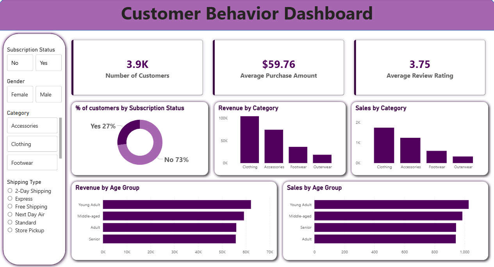

# Customer Shopping Behavior Analysis

## Project Description
This project analyzes customer shopping behavior using transactional purchase data.  
The objective is to identify patterns in customer spending, product preferences, and purchasing behavior to generate useful business insights.

The workflow includes **data cleaning in Python, business analysis using SQL, and interactive visualization using Power BI**.

---

## Dataset
- **Total Records:** 3,900
- **Columns:** 18

### Data Includes
- Customer demographics (Age, Gender, Location, Subscription Status)
- Purchase details (Item Purchased, Category, Purchase Amount, Season, Size, Color)
- Shopping behavior (Discount Applied, Previous Purchases, Review Rating, Shipping Type)

---

## Data Processing
Steps performed using **Python (Pandas)**:
- Loaded dataset and explored structure
- Handled missing values in Review Rating
- Standardized column names
- Created new features such as **age groups**
- Removed redundant columns
- Loaded cleaned data into **PostgreSQL**

---

## SQL Business Analysis
Key insights were generated using SQL queries:
- Revenue by gender
- High spending customers using discounts
- Top 5 products by rating
- Shipping type comparison
- Subscribers vs non-subscribers spending
- Customer segmentation (New, Returning, Loyal)
- Top products per category
- Revenue contribution by age group

---

## Power BI Dashboard

### Dashboard Preview

The dashboard provides insights such as:
- Total customers
- Average purchase amount
- Average review rating
- Revenue by category
- Sales by age group
- Subscription distribution

---

## Key Insights
- Clothing category generated the highest revenue.
- Loyal customers form the largest customer segment.
- Express shipping users tend to spend slightly more.
- Some products rely heavily on discount purchases.

---

## Tools Used
- Python
- Pandas
- PostgreSQL
- SQL
- Power BI
